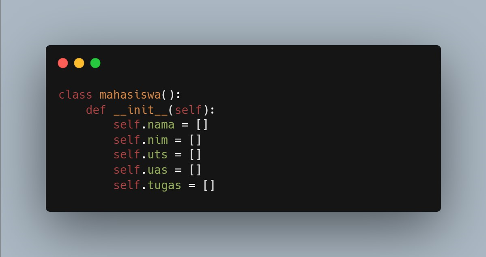
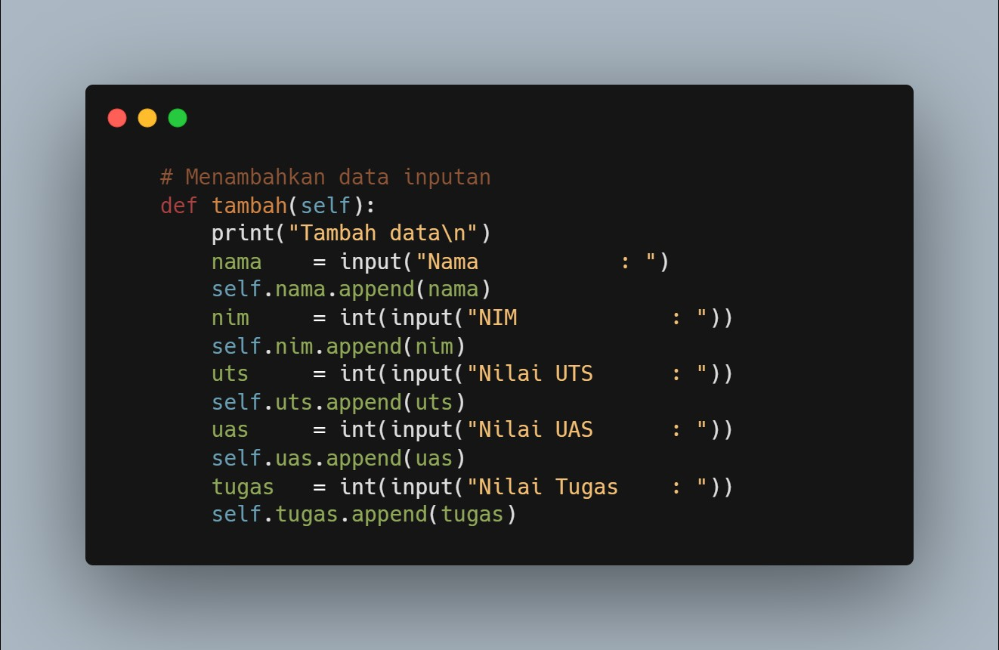
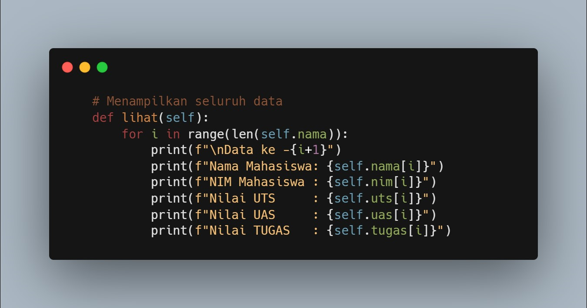
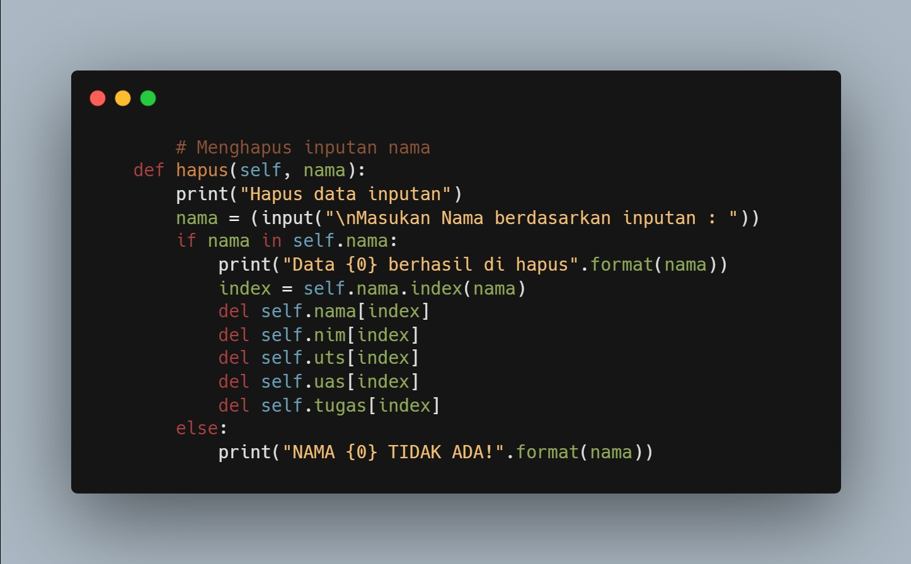
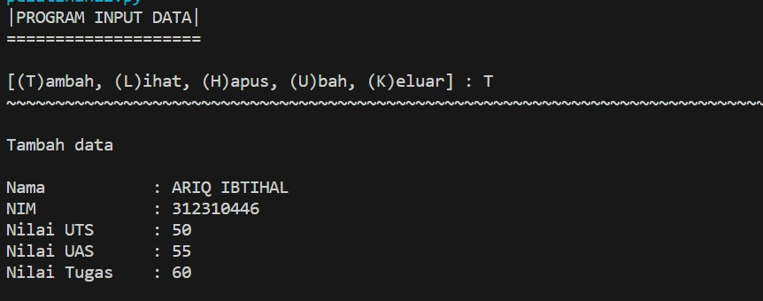
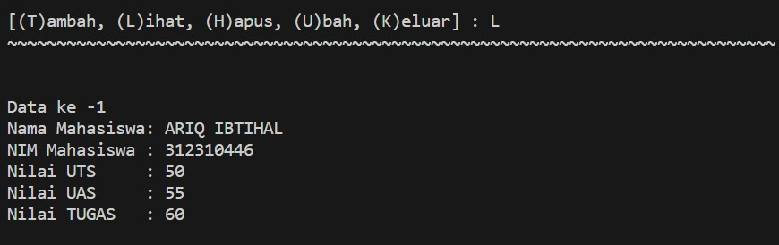
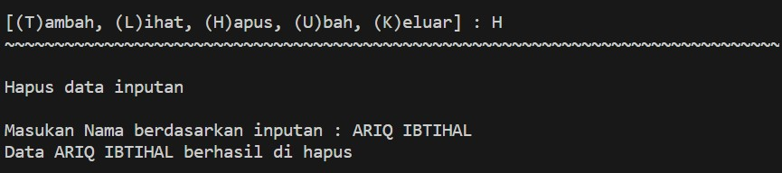
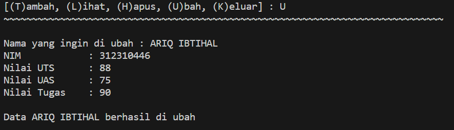
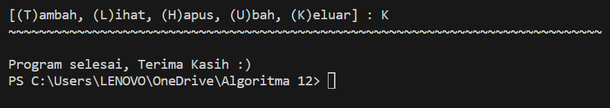
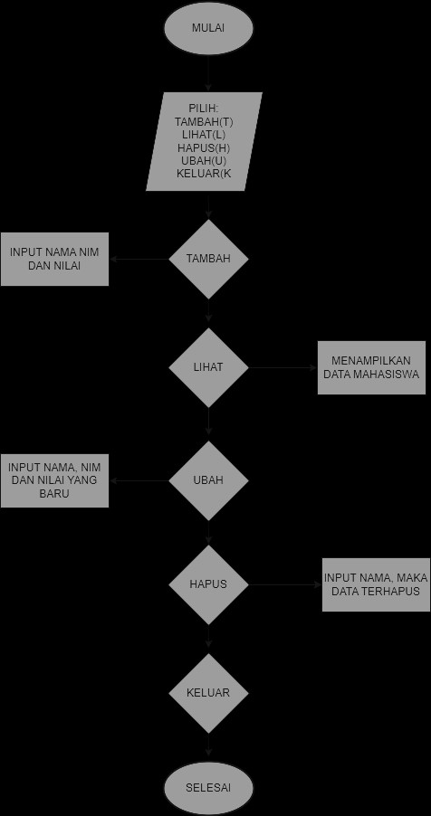

# Pertemuan-12
# OOP

## Profil
| Variable | Isi |
| -------- | --- |
| **Nama** | Ariq ibtihal |
| **NIM** | 312310446 |
| **Kelas** | TI.22.A.5 |
| **Mata Kuliah** | Bahasa Pemrograman |

### Tugas Praktikum
Buat program sederhana dengan mengaplikasikan penggunaan class. Buatlah 
class untuk menampilkan daftar nilai mahasiswa, dengan ketentuan:
- Method tambah() untuk menambah data
- Method tampilkan() untuk menampilkan data
- Method hapus(nama) untuk menghapus data berdasarkan nama
- Method ubah(nama) untuk mengubah data berdasarkan nama

- Membuat `class mahasiswa():` dengan instance class  

- Menambahkan method / fungsi, pada data inputan `Nama`, `NIM`, `UTS`, `UAS`, `Tugas`.

- Menampilkan method / fungsi. `f` = Format

- Menghapus data yg sudah di input. `del self.nama[index]` = menghapus nama
- `[index]` Berfungsi agar inputan menjadi onject

- Mengubah data yg sudah di input
- `index = self.nama.index(nama)` Membuat variable index dengan `self.nama` di dalam ny

`` Python
print("="*20)
print("|PROGRAM INPUT DATA|")
print("="*20)

data = mahasiswa()
`
while True: 
    print()
    menu = input("[(T)ambah, (L)ihat, (H)apus, (U)bah, (K)eluar] : ")
    print("~"*78)
    print()

- Perulangan dengan memilih [T/L/H/U/K] untuk menjalankan program apa yg ingin di gunakan.

### Hasil Program 

#### Menambahkan data 

#### Melihat data

#### Menghapus data

#### Mengubah data

#### Keluar

### FLowchart 
!
# Terima kasih
